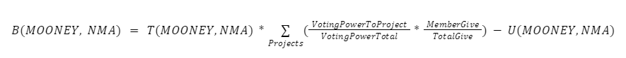

**MoonDAO Projects are the launch point for mission-aligned people to build on top of the foundation and network of MoonDAO.**

MoonDAO Projects are goal-oriented teams working on mission-aligned objectives. This document provides the framework to fund the team, support their progress, align their interests with the DAO, and provide retroactive incentives for projects that get us one step closer to a permanent settlement on the Moon.

MoonDAO Projects are composed of Rocketeers that lead a team of MoonDAO members referred to as Moonsettlers. Along with work on their core objective, Rocketeers have a responsibility to co-govern MoonDAO in the Senate. Projects are supported by Delegates who have a responsibility to help the project follow best practices and ensure they meet all the requirements outlined in this document.

### Project Proposal Process

- **Step 1:** ***Post in the “project-ideation” channel on Discord.*** You don’t need to have a fully formed idea for a project yet, and you can be pretty informal at this stage. There are two things to articulate in the ideation channel: 
    1. Problem to be solved.
    2. Proposed solution.
This is meant to help YOU get feedback from people on the idea, offer alternative solutions, and allow for informal coordination around ideas. Anyone can post about ideas regardless of their background in the DAO, even if they aren’t yet part of our community.

- **Step 2:** ***Find a Delegate to support the proposal.*** If you haven't staked 250,000 MOONEY you will need at least one person that has a Delegate role at MoonDAO to support the idea. This person is responsible for ensuring that the project meets all the requirements and follows the rules set forward for projects.

    MoonDAO takes transparency, integrity, trust, and responsibility very seriously. Delegates may not receive Payment or Rewards directly from the project, since they are intended to act as neutral arbiters.  If the project does not follow MoonDAO’s rules and the Delegate does not make the DAO aware of the project breaking MoonDAO’s rules, the Delegate will be penalized from being allowed to bring more projects forward for a year. If the project succeeds in its objective, the Delegate will be rewarded with 2% of the project’s Coordinape project rewards (see Retroactive Rewards section for more information). Delegates are responsible for:
        1. Creating the project multisig, and being part of the multisig.
        2. Ensuring the payment methods for the project are created.
        3. Compiling a monthly report on the progress of the project for the DAO.
        4. Helping submit the final report for the project.
        5. Setting up and maintaining the project’s DeWork and Coordinape.
        6. Creating the project’s folder on Google Drive.
        7. Cleanup of the project after it has finished.

- **Step 3:** ***Proposal Submission.*** A project template (below) must be filled out with the help of the Delegate to workshop the project and make sure it fits all the requirements. Once the project meets all the requirements to be put up, then the Delegate will submit the proposal on Discord under “Proposal Submit.” The proposal must be posted 48 hours before the Senate meeting. This will allow Senate members to review your proposal and provide an in-depth review of the project prior to the Senate meeting. Project approval permissions vary as follows:
  1. If the prospective Rocketeers have already successfully completed a project before, and the proposal does not require up-front funding from MoonDAO, and it doesn’t require crowdfunding from the community, the Senate does not need to vote on the proposal and it may proceed permissionlessly, as long as the proposal was submitted, presented to the Senate for awareness, and verified as legitimate by an Astronaut.
  2. If the proposal does not require up-front funding from MoonDAO, but it does require crowdfunding from the community, the Senate will do a due-diligence on the specifications, objective, and team for the Project, and will vote on approving the project as outlined in our Constitution, but it does not need to go through a DAO-wide vote.
  3. If the proposal requires up-front funding from MoonDAO it must go through DAO Governance as outlined in the Constitution. Multisig and Project Revenue split contracts should be created before snapshot voting.
  The Proposal must follow the template provided hereunder, if the proposal does not follow its relevant template, then it will not be considered valid and will not go forward for a Senate vote.

For proposals going through the Senate, the proposal requires three in-depth reviewers from Senate Members. Once they feel like the proposal is ready to go, they must sign off at the bottom of the proposal as having done their due diligence and had their concerns (if any) met. Reviewers shall not be a part of the project team. If the project succeeds in its objective by submitting an approved final report to the DAO, each signer will receive 1% of the project’s Coordinape rewards. If multiple people provide feedback, the project Rocketeers will choose the top 3 people that gave them the most in-depth feedback.

### Project Start
The Project’s Rocketeer(s) becomes a member of the Senate as outlined in our DAO Constitution. Members of the Senate retain their position until the end of the quarter when their objective was completed. Senate members are required to attend weekly Senate meetings and required to vote and review incoming proposals. Project Rocketeers must ensure the following is completed BEFORE receiving their budget:

1. **Multisig creation and administration.** If the project requires more than one payment the Delegate must create a Gnosis multisig with at least a three out of five execution threshold to receive the funds. Rocketeers must keep a record of multisig transactions and ensure that the final report includes a justification for payments (who was paid, how much, and key deliverables from the payment).
2. **Payment method MVP streaming.** If a project member is receiving a fixed payment upfront for their work, the project multisig may stream the payment over the course of the project until the project’s deadline. Payment streaming may be turned off by the team’s multisig if a member is no longer fulfilling their responsibilities. Alternatively, the project may send the payment in full at the end of the project.
3. **Project management.** Delegates are responsible for setting up the MoonDAO tools for their teams. MoonDAO uses DeWork as a Kanban board for task management, Google Drive for document management, and Discord for DAO communication. Delegates must do the following:
    1. [Make a Google Drive folder](https://drive.google.com/drive/u/0/folders/0ALhEF4XlxUfXUk9PVA) for their project within the MoonDAO Organization. Put your original proposal document in that folder as a PDF.
    b. [Create a DeWork space](https://app.dework.xyz/moondao) for their project and assign each task to the members of the team. If a task is open, create an open bounty for the task. MoonDAO Guild members can either be assigned to open tasks as Moonsettlers, or the Rocketeer can make it an open competition and receive multiple entries and decide on the winner. Rocketeers can decide the amount to give for the open task (in MOONEY or DAI), and even allow them to be on the project’s Coordinape.
    2. [Create a Discord channel under “Active Projects”](https://discord.com/channels/914720248140279868/947192795586781205) to coordinate the project’s communication and work transparently inside of the DAO. Transparent communication is essential at MoonDAO to help people coordinate effectively and prevent misunderstandings, please keep your project’s non-sensitive communication on Discord as much as possible.
    3. [Create a Coordinape](https://docs.coordinape.com/get-started/circles/creating-a-circle) for the project for people to begin noting their contributions.
    4. Create a weekly meeting on the MoonDAO calendar for your project for giving updates and coordinating needs for the project. (To create a meeting simply type “/create” in our Discord and you can add the details for your calendar event. You may further edit it in the web UI after the event is created to make it repeat etc.)
4. **Juicebox Creation (optional).** The project may create a Juicebox project to raise more money for their idea. The project must be configured with a 10% reserve of ETH funds raised going to the main MoonDAO Treasury. NFTs may be granted for contributions that have voting rights for the project’s progress, but no ERC-20s.

### Project Updates And Responsibilities

Throughout the lifetime of the Project the **Rocketeer** must do the following:

1. **Provide Monthly Progress Updates to the Senate.** Every month of progress on the project the team must provide a written report and present it at the Senate meeting. It will be reviewed by the Senate, and they will assess the progress of the project. This is intended to be a helpful meeting to give context to the DAO on progress and also have the DAO find ways to support the project. However, if the project is not meeting the expectations of their project or no progress has been made, then the Senate may vote on shutting the project down. If a project is shut down, all remaining funds must be returned to the DAO.
2. **Attend weekly Senate meetings.** Senate members must attend the weekly leadership meeting and are required to vote on Senate decisions as outlined in the DAO Constitution. They are encouraged to help review incoming project proposals and share their thoughts on matters of DAO governance. Failure to attend meetings without notice or not vote in a timely manner will result in penalties to retroactive compensation. For each missed Senate vote, defined as no vote within 24 hours of the proposal being active, the team will be deducted 5% of their retroactive rewards. If a Senate member misses more than three votes, the project may be shut down. Special exceptions can be made for members on different time zones where attendance is infeasible.

Other members of the project with assigned tasks become **Moonsettlers.** These members must:

1. **Provide weekly written updates on progress.** Post updates on work in the “Weekly Updates” channel above active projects.
2. **Keep a record of contributions.** It is highly recommended to keep a record of the work completed, this can be done within the weekly updates and will be helpful when filling out the Final Report and Coordinape at the end of the project.
3. **Update their task progress on DeWork.** Ensure that your task is being tracked on DeWork and the progress of the task is updated.

### Project Completion
The Project Delegate and Rocketeer must make sure the following are complete:

1. **Complete a Final Report (attached below).** Each project member must include their contributions in the final report. Reports must be submitted to the DAO in the “Final Report” channel on Discord before the end of the quarter to be included in that quarter’s reward cycle. These reports will be attached on Snapshot for final voting by the DAO.
2. **Return excess funds to the DAO treasury.** Please attach a link to the DAO’s multisig in the final report along with a table including the justification for expenses.
3. **Coordinape for rewards distribution.** Every project member receives 100 GIVE and must distribute their full amount, except smaller teams of four or fewer if there is an agreement on distribution amounts with all members agreeing on the distribution in writing. Project Rocketeers may also add anyone else in the Coordinape that they thought provided help to them but were not officially part of the team on the proposal, however, those added members do not receive any GIVE. Each person on the Coordinape must include their list of contributions in the final report. Please include a link to this completed Coordinape in the Final Report.
4. **Update roles.** Update Moonsettler and Rocketeer roles to Voyager roles (distinguished members of MoonDAO who have successfully completed a project).
5. **Create Documentation.** If someone needs to maintain the work after it’s completed, or users need to know where things are, please include documentation for the people who come after you.

### Retroactive Rewards
The DAO incentivizes people to start new projects with its quarterly rewards bonus system.

Each quarter, the projects that were completed will be eligible for Project Rewards if and only if they have submitted their Final Report to the DAO and it has been approved by the Astronauts. Final reports must be submitted by the end of the quarter.

The total amount of rewards each quarter is calculated as follows:
	
1. 5% of the liquid non-MOONEY assets (NMA) (e.g. ETH, DAI, and other stables) paid in the form of DAI. Assets with fluctuating prices will be priced at the day at the end of the quarter.
2. A geometric series of MOONEY will be released as follows:
    1. Q4 2022: 15,000,000 MOONEY.
    2. Q1 2023: 14,250,000 MOONEY.
    3. Q2 2023: 13,537,500 MOONEY.
    4. Q3 2023: 12,860,625 MOONEY.
    5. And so on, infinitely, decreasing by 0.95 every quarter.

The DAI will be given as a lump-sum reward. The MOONEY will be streamed over the next year as long as the member remains engaged in a MoonDAO project as either a Rocketeer or Moonsettler. This way members that work for a long time at MoonDAO will accrue rewards and we have an incentive for people to remain active at the DAO.

At the end of the quarter, the Senate will be presented with all the projects that were completed along with their Final Reports, and they will be allowed to allocate what they think is a fair proportion of rewards that should go to each project. Then a Snapshot vote will be created for members to delegate their voting power to each Senate member’s distribution they most agree with. The up-front payment will be subtracted from the quarterly project rewards bonus.

A member’s reward bonus, B, will be calculated as follows:

Where:
- T(MOONEY,NMA) is the total rewards for the quarter in both MOONEY and Non-MOONEY assets (NMA) as determined in the previous paragraph.
VotingPowerToProject is the total sum of voting power that was allocated to that particular project in the Member House. Voting Power for each voter is calculated as determined by our Constitution.
- VotingPowerTotal is the total amount of voting power tallied for that quarter’s vote in the Member House.
- MemberGive is the total amount of GIVE that was allocated to that member in that particular project.
- TotalGive is the total amount of GIVE that was allocated to that particular project.
- U(MOONEY,NMA) is the amount of upfront payment that the member received in MOONEY and Non-MOONEY assets **for all projects, [guilds](guilds.md), or salaries coming to that member in that quarter.**

If the B is negative for MOONEY or NMA, the Member will receive no bonus for that token.

**Example:**

For example, Bob received 1,000 DAI and 10,000 MOONEY up-front for his Project. The DAO has $500,000 in non-MOONEY liquid assets (ETH, DAI, USDC) at the end of Q4 2023. Bob’s Project received 10% of the voting power in the Member House. He received 25% of the total on Coordinape for that project. What is his reward?

Total DAI Pool = 5% * $500,000 = $25,000
Total MOONEY Pool = 15,000,000 MOONEY * (0.95)^4 = 12,217,593.75 MOONEY

Bob’s DAI Bonus before subtracting the upfront payment = 25,000 * 0.10 * 0.25 = 625 DAI.
Since he already received 1,000 DAI, he will receive no DAI bonus.

Bob’s MOONEY Bonus before subtracting the upfront payment = 12,217,593.75 MOONEY * 0.10 * 0.25 = 305,439.84 MOONEY.
Since he received 10,000 MOONEY upfront, his total bonus is 295,439 MOONEY.

Therefore Bob’s Total Rewards are = 1,000 DAI + 10,000 MOONEY + 295,439 MOONEY = 1000 DAI and 305,439.84 MOONEY.

### Project Revenue Distribution

MoonDAO has a standard on-chain deal with projects. The terms are fuzzy and can be specified further on a case-by-case basis with projects. If there is an agreement to distribute revenue, the specifics of the on-chain deal must be linked in the project proposal and signed by the project team’s multisig. We have a standard on-chain contract that teams can sign from their generated multi-sig.

If a MoonDAO project creates any profits, they will be distributed as follows:

1. **Recoup first:** MoonDAO’s total commitment to the project is its upfront payment to create the Project (in the project proposal) PLUS any retroactive rewards went to the project. The revenue is split via a waterfall system, where the DAO’s payment is first recouped along with any other parties that put up a commitment on a pro-rata basis. In other words, if MoonDAO put in $150k and another group put in $50k, then for every dollar up to $200k, MoonDAO will receive 75% and the other party will receive 25%. Next:
2. **Revenue split:** After the recoup is completed, 50% of revenue will go to the project team, and be distributed to individual team members in the same proportion as the team’s Coordinape when submitted. 50% of revenue will be distributed to the parties committing up-front capital on a pro-rata basis in proportion to the amount of up-front capital committed to the project measured in dollars at the time of funding. If MoonDAO is the only party committing capital up-front, then 50% of the revenue will return to the DAO’s treasury.

Each project will create a custom split contract with these conditions input, and include that agreement as linked in the project. They will only use that contract to receive revenue for the project.

Unless otherwise specified, this agreement will exist for two years, with the right to renegotiate terms after the period is over.

After the period ends, if the Project Team decides to continue working on the project separately from MoonDAO, then MoonDAO will receive a 10% stake in the organization. Both in equity and in tokens if they are created. MoonDAO has the option to be included in any future capital raises for the project. MoonDAO may license its brand to the organization for future work and can continue to create new agreements and partnerships with the organization.

In some circumstances, a formal off-chain agreement may be signed between the project team and the DAO to specify the details of this deal, in the jurisdiction of the Project Team’s choice. This agreement must be linked in the project proposal.

### Project Intellectual Property

Unless otherwise noted all projects use a creative commons license and all their work will be open-sourced to the world.

If any intellectual property is generated by the internal project team, it will be co-owned by the project team and MoonDAO. Any patents, trademarks, copyrights, or trade secrets generated will be co-owned with a 50% share going to MoonDAO and other parties that put up capital proportional to their share of the total, and a 50% share going to the project team.

The project team will have the ability to license, use, modify, exploit, and enforce IP rights against third parties, and make decisions about IP-related matters. Revenue for the IP will be based on co-ownership shares.

If IP rights are reserved, they will be represented through on-chain IP-NFTs representing the intellectual property.

### Dispute Resolution

Disputes between the project team and the DAO will be handled through arbitration as outlined in [the MoonDAO Constitution](Constitution.md).

If Dispute Resolution through MoonDAO’s arbitration procedure is unsuccessful, the dispute will be resolved through binding arbitration, referring to the rules of established arbitration institutions, such as the American Arbitration Association (AAA) or JAMS, which will provide procedural guidelines for the arbitration process.

### Miscellaneous FAQs:

**Can a project change Rocketeers?**

Yes. If a Rocketeer must step down for whatever reason but the project is not yet completed, an Astronaut may appoint a new Rocketeer to lead the project.

**Can Rocketeers be external to MoonDAO, or must they be members?**

Rocketeers must be MoonDAO members before they start a project. If someone wants to join a project but is not yet a member, they should be on-boarded into the community and stake MOONEY before starting work, but it is not a strict requirement.

**What happens if the project misses its deadline?**

If you are going over the originally intended timeline please notify the Senate in your monthly update. If the deadline extends into a new quarter the Astronauts will have to approve the project’s continuation.

**Who can be on the Project’s multisig?**

Multisig signers should include the project Rocketeers and other trusted members of our community that have had a role (MoonSettler or above) for more than a month. Multisig members should be using the highest level of security possible.

**What if a project requires a Budget increase?**

If a budget needs to be increased it must go through the full project proposal process with a justification for the budget increase.

**How do we amend the project system?**

The Astronauts can propose to amend this system by going through our DAO Governance as outlined in the Constitution.

**Can the community change the project team’s decision about a project?**

Generally no. However, if concern about the direction of a project is raised by a community member they are free to message the Rocketeer and ask them directly. If a major issue that goes against our rules is presented, then the Senate can vote to shut the project down (end payment streaming, receive treasury back, remove member’s roles, and exclude the project from quarterly rewards), and slash the Delegate’s stake.

------

## MoonDAO Project Proposal Template
Each project will need to fill out the template below and submit it under “proposal-submit” at least **two days** before the Senate meeting. **Proposals should be no more than 4 pages max. If it is longer, consider factoring out your proposal into separate documents.
**

**Project Title: e.g. MoonDAO Merch**

**Abstract:** This is a top-level description of the idea. Please use ELI5 wording and summarize things for anyone to understand what you want to achieve.

**Problem Statement:** Describe the problem your proposal solves.

**Solution:** Describe the “meat & potatoes” of the proposal. Go into necessary detail about the work that needs to be done, alternative solutions considered, open questions, and future directions. Keep it concise.

**Benefits:** Point out the core benefits of the proposal implementation and how it will affect MoonDAO. If the proposal can create revenue please create justification for how much revenue it could generate.

**Risks:** Highlight any risks from implementing the proposal and points to consider regarding the proposal.

### Objectives and Key Results
[If you are unfamiliar with OKRs please read this article on how to write an effective OKRs 
Project scorecard 
](https://docs.google.com/spreadsheets/d/1Ng0UuwHrnurkRbi-joJBsYjdNSRl60AmO1pL1CpKkKA/edit?usp=sharing)

You can write as many OKRs as you think are needed. One OKR is fine if that captures the full extent of what you want to achieve. One focused goal is preferred instead of many. Objectives should use SMART principles (Specific, Measurable, Achievable, Relevant, and Time-Bound). 

**Objective #1:** e.g. Create high-quality merchandise that can be sold online and distributed at events to promote MoonDAO.

**Key Results for Objective #1: **
- Create an online Shopify marketplace where we sell our merchandise. 
- Design and sell 100 high-quality MoonDAO shirts.

**Member(s) responsible for OKR and their role:**
- DiscordUser1: Their role on the OKR, their focus to making this possible
- DiscordUser2: …

### Team Table (Table A)
*There can be a maximum of two team Rocketeers. Project teams may not need an initial team. It can just be an individual submitting a proposal. As a general rule of thumb, try to keep teams small and focused in the beginning, **with clear deliverables and OKRs for each member.***

|                                                                                                                |                                                                                       |
| -------------------------------------------------------------------------------------------------------------- | ------------------------------------------------------------------------------------- |
| **Team Rocketeers**                                                                                            | @DiscordUser1                                                                         |
| **Initial Team**                                                                                               | @DiscordUser2, @DiscordUser3, @DiscordUser4                                           |
| **Delegate **                                                                                                  | A member who has stakes at least 250,000 MOONEY. Cannot be on the initial team, nor the team Rocketeer. |
| **Foreign Language Representative (optional)**                                                                 | @DiscordUser5                                                                         |
| **Multi-sig Signers (if Budget is needed. This must be at least 5 people with a 3/5 execution threshold )   ** | @DiscordUser1, @DiscordUser2, @DiscordUser6, @DiscordUser7, @DiscordUser8             |
| **Multisig ETH address  **                                                                                     | Multisig address must be created before the project is submitted to Snapshot.         |
| **Revenue Split Agreement Address     **                                                                       | If there is revenue for the project, a split agreement should be created.             |

**Team Rocketeer(s) Bio:** Lorem ipsum dolor sit amet, consectetur adipiscing elit, sed do eiusmod tempor incididunt ut labore et dolore magna aliqua.

**Team Rocketeer Payment (optional):**

**Initial Team Bios**
*Include one bio for each team member*

**Team Member #1: **
**Bio/background:** Lorem ipsum dolor sit amet, consectetur adipiscing elit, sed do eiusmod tempor incididunt ut labore et dolore magna aliqua.
**Team Member Payment (optional):**

**Team Member #2: **
**Bio/background:** Lorem ipsum dolor sit amet, consectetur adipiscing elit, sed do eiusmod tempor incididunt ut labore et dolore magna aliqua.
**Team Member Payment (optional):**

### Estimated Project Timeline (Table B)
These just need to be a rough timeline of milestones for the project. This is mostly intended to help you put together an idea of the work that needs to get done and when you hope to finish each deliverable. Please add each of the monthly reviews and milestones.

| Date         | Description                          |
| ------------ | ------------------------------------ |
| Mar 28, 2022 | List of potential Manufactuerers     |
| Mar 29, 2022 | Reach out to Manufacturers           |
| One Month    | Review #1 at Senate meeting + Report |
| Apr 15, 2022 | Ship out Hoodies                     |

**Deadline for the project: (e.g. 18th of April, 2022)**

***This is the date by which you think the OKRs will be completed. If you are going over the deadline for the project, please let the DAO know and give a new estimate of when the work is intended to be completed.***

### Budget Justifications (Table C)
These are fixed costs to make your project happen. This might also include bounties that you’ll make inside of the DAO (it’s recommended to have some amount allocated for bounties or competitions), or specific work that must be contracted out to complete the project. Please provide links to quotes where possible.

| Description                                             | Amount         | Justification         |
| ------------------------------------------------------- | -------------- | --------------------- |
| Manufacturing Costs with x Manufacturer for 100 Hoodies | $1000          | (link to pdf quote)   |
| Bounty for a shirt design competition                   | 100,000 MOONEY | Community engagement. |
| Total MVPs for team                                     | $X             |                       |
| ...                                                     | ...            | ...                   |
| **Total**                                               | **Sum total**  |                       |

### Transactions to be Executed (Table D)

| Transaction Type | Amount  | Token Type   | Receiving Address |
| ---------------- | ------- | ------------ | ----------------- |
| Send             | 1000    | DAI/ETH/etc. | 0x000…0069420     |
| Send             | 100,000 | MOONEY       | 0x000…0069420     |

### Revenue Distribution Agreement
- Standard MoonDAO Agreement.
    - Terms here:
    - 
- Different Agreement
    - Link to on-chain agreement:
    - Link to off-chain agreement:

### In-Depth Approval Senate Signature
This is only required if your project requires up-front funding from MoonDAO or it is going to crowd-raise with support from MoonDAO.

Senate Member Signature #1 __________________
Senate Member Signature #2 __________________
Senate Member Signature #3 __________________

### Project Approval Checklist
If your project is approved please complete this checklist within one week of your project starting.

- [ ] Added Project to the Website Dashboard (Contact Dev Rocketeer for info)
- [ ] Created Multisig to receive the funds
- [ ] Updated member roles
- [ ] Created Juicebox (optional)
- [ ] Made Google Drive Folder
- [ ] Created DeWork Space For Project
- [ ] Created Discord Channel for Coordination

---

## Project Final Report Template
### Summary
One paragraph summary of the Project report. Please include a link to the original snapshot proposal passed.
### Results
For each OKR list out each of the following sections:

1. **Objective:** Copy paste the objective that was in your proposal.
   1.  **Key Result:** Copy paste the key result in your proposal.
       - Member(s): List the members responsible for this key result or objective.
       - Results: Link the actual results, or if there is no actual product include a link to a writeup describing the actual results. Writeups are not necessary, the work should speak for itself. Not having a link to a finished product is usually a bad sign!
       - Learnings: What went well? What went wrong? How could this have been done better? Keep this concise. This is meant to help MoonDAO do better next time.
       - Maintenance: Ideally there is no maintenance involved with what was created. If there is, please leave a guide here. Just link the guide in a separate document.
       - Team’s Self-reported Score: The team should get together and discuss the result and come up with a number from 0 (incomplete) to 1 (absolute success). If you have a quantitative metric, please divide the actual results by what you actually achieved. If greater than 1, just leave at 1. Keep in mind, each KR should be a little bit of a stretch to complete, it’s ok to not get a 1. If you got all 1s then you may not have been ambitious enough. Please be honest. Reporting a 1 with no tangible results will backfire.
    2. **Key Result:** Key result number two. So on.
        - Member(s):
        - Results:
        - Learnings:
        - Maintenance:
        - Team's Self-Reported Score:
2.**Objective:** Objective number two. So on
    1. **Key Result:** Key result one from objective number two. So on.
        - Member(s):
        - Results:
        - Learnings:
        - Maintenance:
        - Team's Self-Reported Score:

### Team Member Contributions
*Each member should take some time to fill this out with the specific contributions they had to the team. This will serve as a reference when team members are doing their Coordinape allocations. This is your chance to show off all the great work you did!*

**@TeamMember1**
1. **Objective:** Copy paste the objective that was in your proposal.
   1. **Key Result:** Copy paste the key result in your proposal.
      1. **Specific Contribution:** Link the actual work you did, or include a writeup describing the actual results. If quantitative, better.
      2. **Impact:**How did this contribute to the overall objective? How can you measure its impact?
      3. **Complexity:** Why was this non-trivial to do? What challenges did you overcome?
   2. **Key Result:** Key result number two. So on.
      1. **Specific Contribution:**
      2. **Impact:**
      3. **Complexity:**
2. **Objective:** Objective number two. So on.
   1. **Key Result:** Key result one from objective number two. So on.
      1. **Specific Contribution:**
      2. **Impact:**
      3. **Complexity**

### Coordinape Results

[Link to the Coordinape](https://coordinape.com/): Make the Astronaut the admin.

| Member Name     | % of total rewards | Upfront Payment          |
| --------------- | ------------------ | ------------------------ |
| @TeamMemberName | 21%                | 3,000 DAI, 50,000 MOONEY |
| ...             | ...                | ...                      |

### Treasury Transparency
Link to Treasury with unused funds returned to the main DAO Treasury.

| Txn Title      | Reason                       | Recipient   | Etherscan Link | Deliverable             |
| -------------- | ---------------------------- | ----------- | -------------- | ----------------------- |
| Legal Retainer | Retainer for contract lawyer | Layers Inc. | link           | PDF of contract created |
| ...            | ...                          | ...         | ...            | ...                     |

### Project Wrap Up Checklist
- [ ] Added Project Final Report onto the Website Dashboard
- [ ] Upload Final report to the Google Drive
- [ ] Returned excess funds to the Treasury
- [ ] Presented Final Report to Senate
- [ ] Update Discord Roles
- [ ] (if needed) Create documentation for users of the work, or people who will need to maintain the project once it is completed.