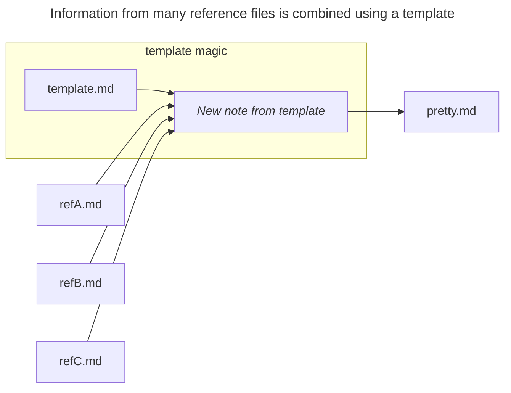

# Reference
Reference data (the files inside `MoonDAO/docs/reference`) is a collection of files meant to be included as references in other docs, but usually not displayed directly. This is because the reference docs tend to hold _metadata_ rather than normal, everyday text.

Automations, plugins, and other tools can easily hook into the metadata and display beautiful documents elsewhere. This means the information from the reference docs only needs to be updated in one place (the reference page) and information will propagate elsewhere, without needing to do any copy and paste or duplication of data.

Now the formatting of `template.md` can be edited separately from the content in each of the `ref[A,B,C].md` reference files. New reference notes can be added, old ones can be removed, and so on. No matter how many changes happen to the reference files, the format of `pretty.md` is unchanged.

The note created from the template, `pretty.md`, is isolated from all "churn" to the reference pages and templates. New versions of `pretty.md` are always intentionally created by creating a new note from the template and overwriting the existing `pretty.md`.
# Automations
Besides ergonomics, another reason to use automations and templates is the fact that community plugins are not supported on Obsidian Publish (the website version of this vault). This means that Dataview queries don't show up on the web. We use a template to get around this by installing Dataview locally and using it to "bake" a static note that is functionally equivalent to the Dataview plugin's dynamic query results view.

> [!NOTE] Hands-on example
 As an example, compare the contents of [Team (dynamic)](Team%20(dynamic).md) (which depends on Dataview) and [Team](Team.md) (which is a standalone note). If you view the two in source mode, it'll be more obvious.

There are two templates that are used to keep member bios organized:
1. Member Bio → `MoonDAO/templates/moondao-member-template`
2. Team (all member bios) → `MoonDAO/templates/team-table-from-tag`

A similar pattern is used to organize the glossary:
1. Glossary Entry → `MoonDAO/templates/glossary-entry-template`
2. Glossary (all entries) → `MoonDAO/templates/glossary-table-from-folder`

These templates are powered by the following community plugins:
* [Dataview](https://blacksmithgu.github.io/obsidian-dataview/) - Enables queries by metadata and displays results as tables.
* [Templater](https://silentvoid13.github.io/Templater/introduction.html) - Enables executing in-line Dataview queries and other scripted operations upon creating a new note from a template.
## Setup
1. Install the Dataview community plugin.
	1. Enable the plugin setting `Enable Inline Queries`
	2. Enable the plugin setting `Enable Javascript Queries`
2. Install the Templater community plugin.
	1. Set the plugin setting `Template folder location` to `MoonDAO/templates`
## Create a new member bio
1. Open the command palette
2. Type `templater new` (for example) and select the command `Templater: create new note from template`
3. Choose the template called `moondao-member-template`. This will create a new note in the current working directory from the member bio template.
4. Edit the contents of the file.
	1. Edit the note's metadata properties with relevant information. The template provides the fields that will be picked up by the automation and pre-populates the note's tags.
	2. In the body of the note, prefix the bio text with `Bio::` — This is an "inline field" for Dataview. It will pick up this data as if it were metadata, even if the data is not in the metadata section of the note. [Dataview's documentation goes into more depth on this topic](https://blacksmithgu.github.io/obsidian-dataview/annotation/add-metadata/#inline-fields).
5. Move the new member bio file to `MoonDAO/reference/Bios` per convention.
## Create a new team page from all bios
1. Open the command palette
2. Type `templater new` (for example) and select the command `Templater: create new note from template`
3. Choose the template called `team-table-from-tag`. This will create a new note in the current working directory from the team page template.
	1. Notice how the table picked up and formatted the metadata and `Bio::` so it looks pretty!
	2. All notes with the tag `moondao/member` will show up in this table.
4. This new note is a standalone note. Do whatever you want with it! 

> [!TIP] Template Magic
> You may have noticed that the template ends with `from-tag`. That's because the query that drives this template has this phrase: `FROM #moondao/member and -"MoonDAO/templates"` i.e. "return all notes that contain the tag `#moondao/member` and are not notes in `MoonDAO/templates`".
## Create a new glossary entry
1. Open the command palette
2. Type `templater new` (for example) and select the command `Templater: create new note from template`
3. Choose the template called `glossary-entry-template`. This will create a new note in the current working directory from the member bio template.
4. Edit the contents of the file.
	1. Edit the note's metadata properties with relevant information. The template provides the fields that will be picked up by the automation and pre-populates the note's tags.
	2. In the body of the note, prefix the bio text with `Related::` — This is an "inline field" for Dataview. It will pick up this data as if it were metadata, even if the data is not in the metadata section of the note. [Dataview's documentation goes into more depth on this topic](https://blacksmithgu.github.io/obsidian-dataview/annotation/add-metadata/#inline-fields).
5. Move the new member bio file to `MoonDAO/reference/Glossary` per convention.

## Create a new glossary from all entries
1. Open the command palette
2. Type `templater new` (for example) and select the command `Templater: create new note from template`
3. Choose the template called `glossary-table-from-folder`. This will create a new note in the current working directory from the team page template.
	1. Notice how the table picked up and formatted the metadata and `Related::` so it looks pretty!
	2. This new note is a standalone note. Do whatever you want with it! 

> [!TIP] Template Magic
> You may have noticed that the template ends with `from-folder`. That's because the query that drives this template has this phrase: `FROM "MoonDAO/reference/Glossary" and -"MoonDAO/templates"` i.e. "return all notes that are in the directory `MoonDAO/reference/Glossary` and are not notes in `MoonDAO/templates`".